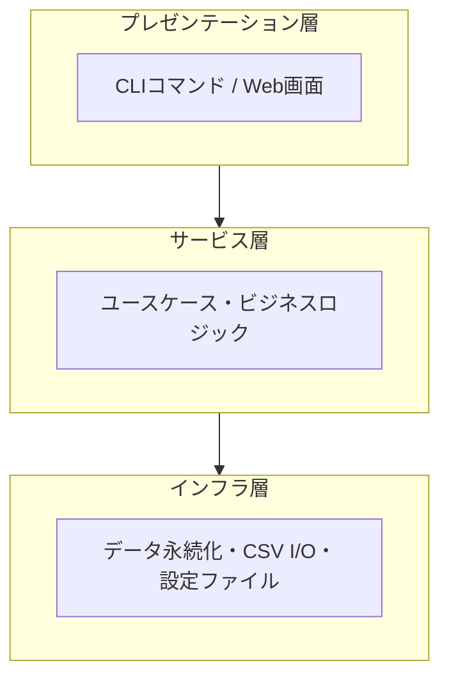
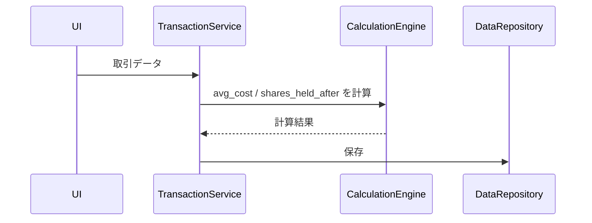
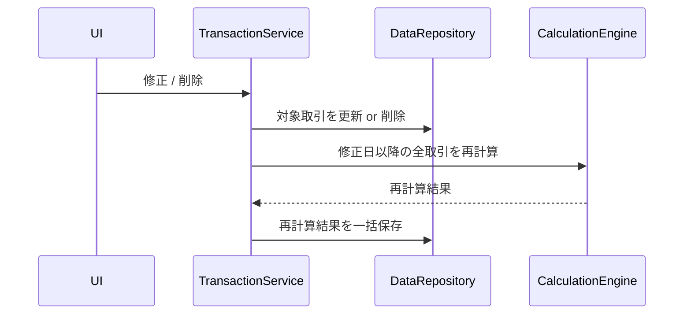
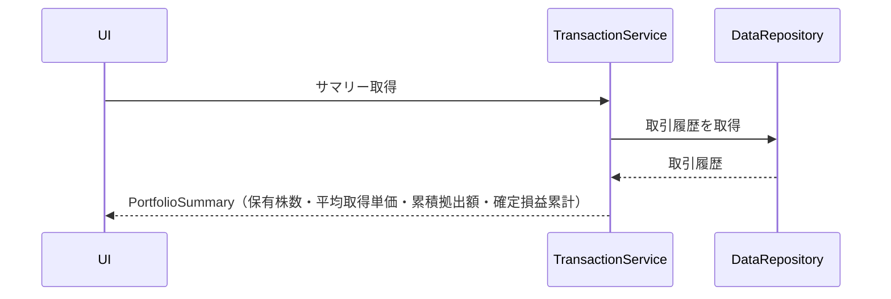
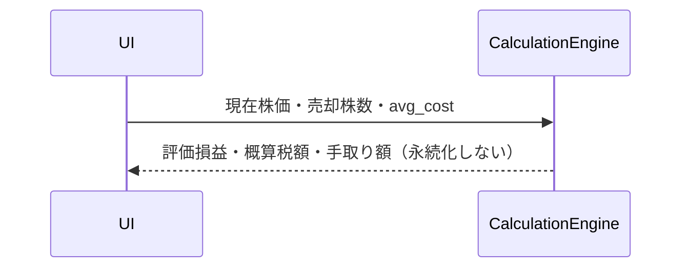
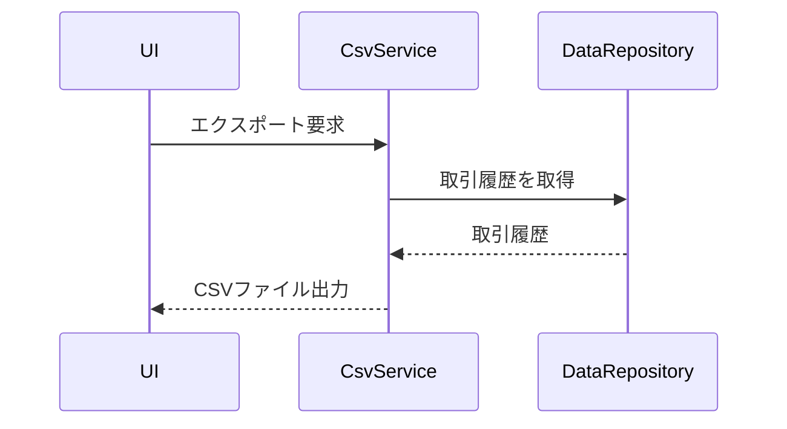
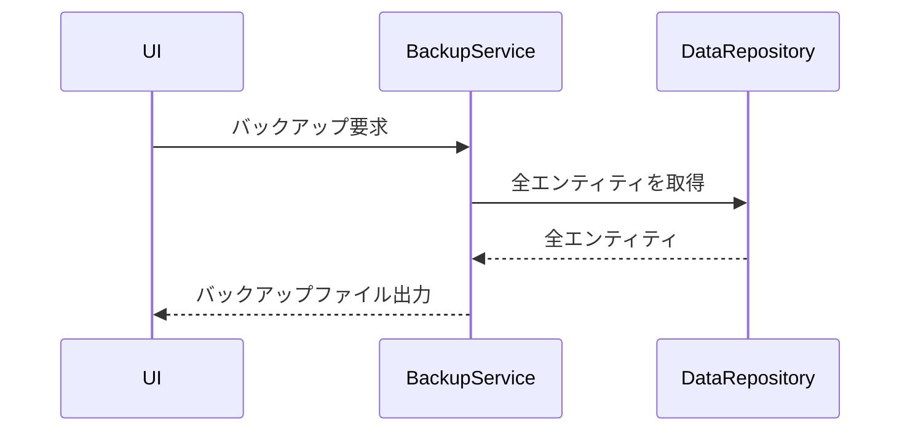

# 持株会管理ツール 基本設計書

バージョン: 1.0.0
作成日: 2026-06-24
ステータス: ドラフト

---

## 1. レイヤー構成

---

## 2. コンポーネント一覧

| コンポーネント | 層 | 責務 | 対応要求 |
|--------------|----|----|---------|
| PlanService | サービス | 持株会の登録・編集・一覧取得 | REQ-0001, REQ-0002 |
| TransactionService | サービス | 取引の登録・編集・削除。更新後に CalculationEngine へ再計算を委譲 | REQ-0003, REQ-0005〜REQ-0007 |
| CalculationEngine | サービス | 移動平均計算・損益計算・税額計算・全件再計算・売却シミュレーション計算 | REQ-0008〜REQ-0011, REQ-0016, REQ-1004 |
| CsvService | サービス | CSVエクスポート・インポート・バリデーション | REQ-0013, REQ-0014 |
| BackupService | サービス | 全データのエクスポート・インポート | REQ-0015 |
| DataRepository | インフラ | エンティティのCRUD・クエリ | — |
| ConfigRepository | インフラ | 外部設定ファイルの読み書き。税率など変更可能な定数を管理 | REQ-1003 |

---

## 3. データフロー

### 取引登録時

### 取引修正・削除時

### サマリー確認時（REQ-0012）

### 売却シミュレーション時（REQ-0016）

### CSVエクスポート時（REQ-0013）

### バックアップ時（REQ-0015）

